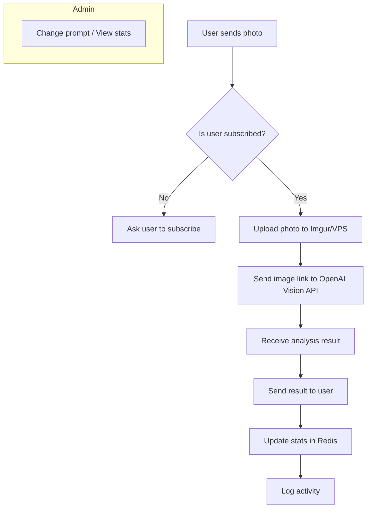

# Food Bot



Асинхронный Telegram-бот для анализа фото блюд с помощью OpenAI Vision API. Поддерживает проверку подписки на канал, работу с публичными и приватными каналами, хранение статистики и промптов в Redis, а также удобные админ-команды.

## Возможности
- Проверка подписки пользователя на канал (через декоратор, поддержка публичных username и приватных invite-link)
- Все сообщения форматируются с помощью HTML parse_mode (устойчиво к спецсимволам)
- Приём фото, загрузка на Imgur (анонимно) или VPS, отправка в OpenAI Vision и получение анализа БЖУ/веса
- Приветствие пользователя по имени
- Статистика по обращениям, фото-запросам, символам в ответах, количеству подписанных пользователей
- Админ-команды: просмотр и изменение промпта, просмотр статистики
- Кэширование промпта и быстрый доступ к нему через Redis
- Обработка ошибок и логгирование

## Структура и стек
- Python 3.11+
- [aiogram 3.x](https://docs.aiogram.dev/en/latest/) — асинхронный Telegram Bot API
- Redis (через redis.asyncio) — для хранения статистики, промптов, подписчиков
- OpenAI Vision API (или совместимый сервис)
- Imgur API — для анонимной загрузки фото (или опционально VPS)
- httpx — асинхронные HTTP-запросы
- dotenv, pydantic — для конфигов и переменных окружения
- Логгирование в файл и консоль

## Переменные окружения (.env)
```
BOT_TOKEN=...            # Токен Telegram-бота
CHANNEL_ID=...           # ID канала (например, -1001234567890)
CHANNEL_NAME=...         # username канала (без @), например dotboot
ADMIN_USER_ID=...        # Telegram user_id администратора
OPENAI_API_KEY=...       # API-ключ OpenAI
IMGUR_CLIENT_ID=...      # Client-ID Imgur
REDIS_URL=...            # (опционально) адрес Redis
```
- Для приватных каналов используйте invite-link вместо username в сообщениях.

## Быстрый старт
1. Клонируйте репозиторий и перейдите в папку проекта
2. Установите зависимости:
   ```bash
   pip install -r requirements.txt
   ```
3. Заполните `.env` (см. выше)
4. Запустите Redis (локально или через Docker Compose)
5. Запустите бота:
   ```bash
   python main.py
   ```

## Развертывание с помощью Docker Compose

Пример `docker-compose.yml` для запуска бота и Redis:

```yaml
version: '3.8'
services:
  redis:
    image: redis:7-alpine
    container_name: foodbot-redis
    restart: always
    ports:
      - "6379:6379"
  bot:
    build: .
    container_name: foodbot-app
    restart: always
    env_file:
      - .env
    depends_on:
      - redis
```

1. Убедитесь, что в `.env` переменная `REDIS_URL` задана как `redis://redis:6379/0`
2. Соберите и запустите:
   ```bash
   docker compose up --build -d
   ```
3. Логи приложения:
   ```bash
   docker compose logs -f bot
   ```

## Рекомендации по настройке канала
- Для публичного канала используйте username
- Для приватного — используйте invite-link в сообщениях (поддержка в коде)
- Бот должен быть подписан на канал и иметь права видеть участников (лучше сделать ботом-админом)

## Админ-команды
- `/stats` — статистика по боту:
    - количество фото-запросов
    - количество символов в ответах
    - количество пользователей с подпиской
- `/get_prompt` — показать текущий промпт
- `/set_prompt` — изменить промпт (через FSM)

## Особенности
- Проверка подписки реализована через декоратор, легко расширяется на любые пользовательские хендлеры
- Все сообщения используют HTML-теги для форматирования
- Временные файлы удаляются автоматически
- Все ошибки логируются

## Лицензия
MIT
